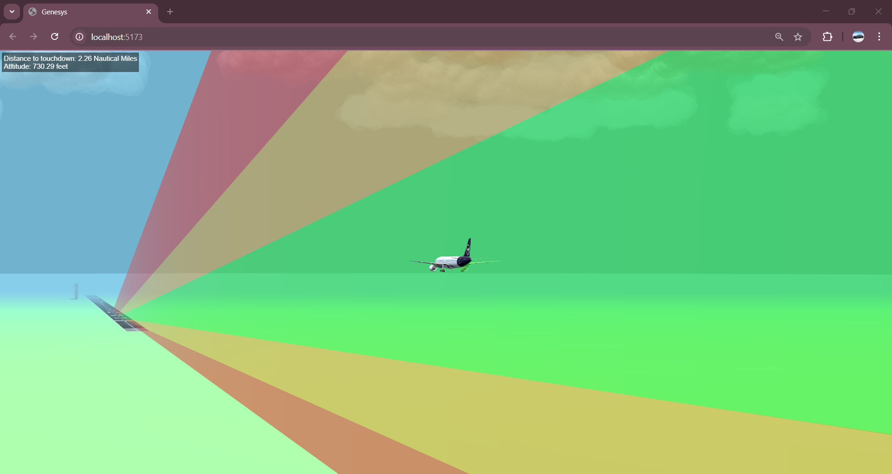
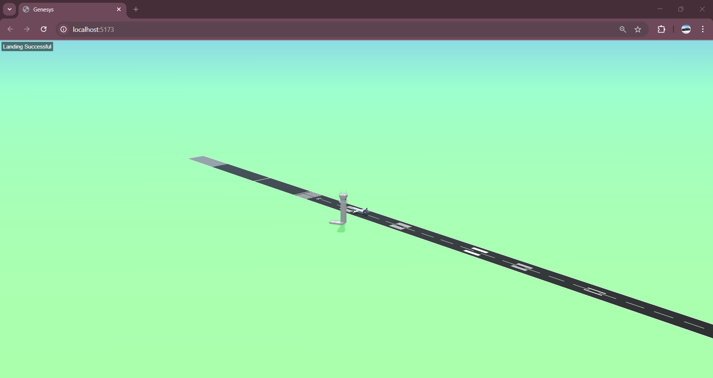
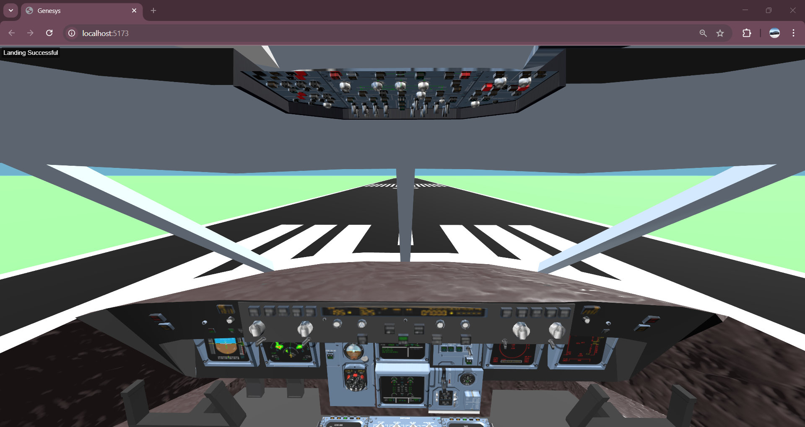
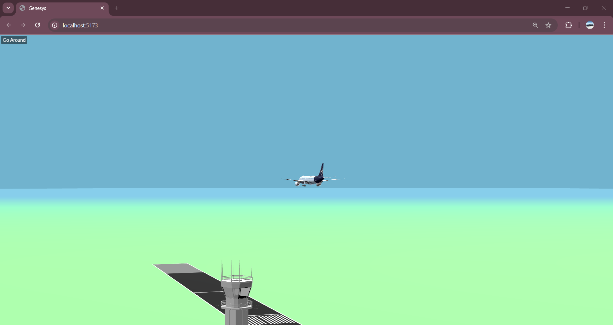

# Genesys Hackathon Website

A glide slope visualiser website that assists pilots during landing and indicates when to go around if the approach is outside safe limits.

This website renders a 3D runway approach scene using Three.js and Vite, showing the aircraft descent path, runway touchdown zone, and live guidance for a safe landing.

## Features

- 3D approach and runway environment
- Animated airplane glide path and landing indicators
- Dynamic clouds, terrain, runway lighting, and tower models
- Camera toggle between chase view and cockpit-style view
- Live altitude and distance feedback during approach
- Keyboard and mouse controls for camera and flight pacing

## Screenshots


A long-range approach perspective showing the aircraft inside the colored glide slope envelope, with distance-to-touchdown and altitude readouts visible in the top-left.


A runway overview after a successful touchdown, showing the aircraft on the runway alongside the control tower and the status message "Landing Successful."


An internal cockpit view looking down the runway, showing the instrument panel and the runway ahead from the pilot’s perspective.


A go-around scenario view showing the aircraft above the runway with the control tower in the distance and the top-left guidance indicator instructing a missed approach.

## Getting Started

### Prerequisites

- Node.js 18+ recommended
- npm or yarn installed

### Install dependencies

```bash
npm install
```

### Run locally

```bash
npm run dev
```

Open the local Vite URL shown in the terminal to view the scene.

### Build for production

```bash
npm run build
```

### Preview production build

```bash
npm run preview
```

## Controls

- Mouse drag: rotate the camera around the aircraft
- Mouse wheel: zoom in/out
- `c`: toggle camera between default chase view and cockpit-style view
- `w`: slow vertical descent for a smoother approach
- `s`: increase descent speed
- `a`: reduce horizontal approach speed
- `d`: increase horizontal approach speed

## Project Structure

- `src/scenes/mainScene.js` — main Three.js scene setup and animation loop
- `src/environment/` — lighting, fog, ground, and sky modules
- `src/loaders/` — model loaders for runway, tower, and aircraft
- `src/movements/flightMovements.js` — glide path, landing, and go-around logic
- `src/objects/plane.js` — helper geometry and runway guidance overlays
- `public/` — static assets and model textures

## Dependencies

- `three` for WebGL 3D rendering
- `vite` for development and bundling
- `gsap` and `html2canvas` included in package dependencies

## Notes

The scene uses runway touchdown zones and altitude/distance indicators to help visualize the landing approach. Adjust the controls during runtime to explore different approach paths.
